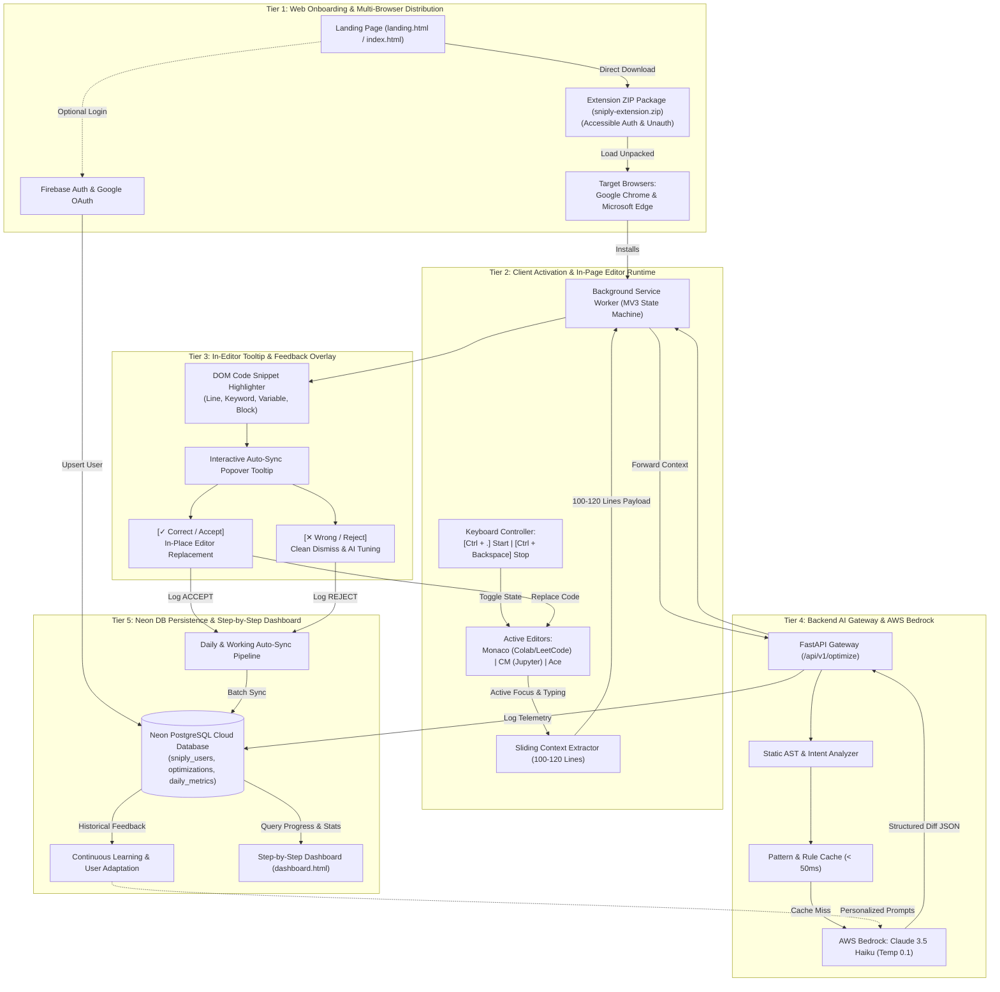
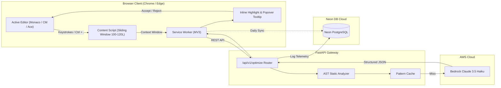

# System Architecture & Clean Topology (Architecture.md)
## Project: Sniply — Anti-Overengineering & Real-Time Code Optimization Assistant

---

## 1. Technology Stack & Component Matrix

| Architectural Layer | Technology | Role & Detailed Specification |
| :--- | :--- | :--- |
| **AI Inference Engine** | **AWS Bedrock (Claude 3.5 Haiku)** | `anthropic.claude-3-5-haiku-20241022-v1:0` with low temperature ($0.1$), deterministic simplicity analysis, Big-O complexity downgrading, and structured JSON output. |
| **Cloud Database** | **Neon PostgreSQL** | Serverless PostgreSQL with SSL (`sslmode=require`), connection pooling (`psycopg2.pool`), user state tracking, optimization history, and daily metric aggregation. |
| **Client Extension** | **WebExtensions (Manifest V3)** | Cross-browser extension supporting **Google Chrome** and **Microsoft Edge** with background service worker, sliding window context extractor, and in-editor DOM injector. |
| **Web Surfaces** | **Vercel Edge Global CDN** | Hosts `landing.html` (universal `.zip` package download for auth/unauth users) and `dashboard.html` (real-time progress, Big-O scorecards, session history). |
| **Backend API Gateway** | **Python 3.11+ / FastAPI** | High-concurrency ASGI gateway running on Render / AWS App Runner with rate limiting, AST static auditing, and AWS Bedrock orchestration. |
| **Static Code Analyzer** | **Python `ast` & Tree-Sitter** | Pre-computes loop nesting depths ($O(n^2)$ flags), unused variables, syntax errors, and cyclomatic complexity before LLM invocation. |
| **Rule & Pattern Cache**| **In-Memory / Redis LRU** | Normalized AST structure hash lookup delivering instant ($< 50\text{ms}$) optimizations for recognized algorithmic bottlenecks. |
| **IDE MCP Integration** | **Model Context Protocol (MCP)** | Standardized MCP Server for professional IDEs (Cursor, Claude Desktop, Antigravity). |

---

## 2. 5-Tier Clean Architecture Overview



---

## 3. Tier-by-Tier Architectural Specifications

### Tier 1: Web Onboarding & Multi-Browser Extension Distribution
1. **Landing Page (`landing.html` / `index.html`)**:
   - Hosted globally on Vercel Edge.
   - Highlights the core value proposition: anti-bloat, Big-O downgrades ($O(n^2) \to O(n)$), and progressive line coaching.
   - Embeds interactive code demo with sample popover tooltip (`max_val = my_list[0]`).
2. **Mandatory Auth-Gated ZIP Download**:
   - The `.zip` download is strictly gated behind Firebase Google OAuth to ensure 100% developer tracking and data integrity.
   - When a developer clicks "Get extension" or "Download .zip package", the Google OAuth modal opens immediately.
   - Upon sign-in, the user's profile (`firebase_uid`, `email`, `displayName`) is registered into Neon DB (`sniply_users`), after which `sniply-extension.zip` automatically downloads.
   - The developer's `firebase_uid` is synced to extension storage, enabling seamless tracking of in-editor optimizations and live analytics on `dashboard.html`.
3. **Multi-Browser Support**:
   - **Google Chrome**: Verified via `chrome://extensions/` (Developer Mode $\to$ Load unpacked).
   - **Microsoft Edge**: Verified via `edge://extensions/` (Developer Mode $\to$ Load unpacked).

### Tier 2: Client Activation, Keyboard Hooks & Context Extractor
1. **Extension Lifecycle Controls**:
   - **Start / Activate**: User presses **`Ctrl + .`** to initialize active editor monitoring and background seeking.
   - **Stop / Deactivate**: User presses **`Ctrl + Backspace`** to pause all observation, release keydown hooks, and remove active overlays.
2. **Multi-Editor DOM Abstraction**:
   - **Monaco Editor**: Hooks into Google Colab, LeetCode, CodeChef. Accesses lines via `.view-line` and replaces text via `document.execCommand("insertText")` on the inputarea.
   - **CodeMirror 6**: Hooks into JupyterLab 4, Replit. Accesses lines via `.cm-content` and `.cm-line`.
   - **CodeMirror 5**: Hooks into Classic Jupyter Notebook. Accesses content via `CodeMirror.getValue()` and `setValue()`.
   - **Ace Editor**: Hooks into Programiz, OnlineGDB, HackerRank. Accesses lines via `.ace_line`.
   - **Standard `<textarea>`**: Fallback for any standard web editor.
3. **Sliding Context Window Engine (100–120 Lines)**:
   - Symmetrically bounds context around the active cursor up to 120 lines to maintain function and variable scope without token inflation.
   - Typing debounce (350ms) ensures analysis executes only during natural pauses.

### Tier 3: In-Editor Tooltip & Interactive Feedback Overlay
1. **Targeted Code Highlighting**:
   - Calculates exact pixel coordinates or DOM line positions of the offending snippet.
   - Places a non-destructive floating highlight badge over the specific line, keyword, variable, or statement block.
2. **Interactive Auto-Sync Popover Tooltip**:
   - Renders an anchored popover box directly adjacent to the highlighted code.
   - **Original vs. Fixed Badge**: e.g., shows `seen = []` replaced with `seen = set()`.
   - **Error / Intention Rationale**: Explains why the current pattern is suboptimal (e.g., *"Linear scan inside loop causes $O(n^2)$ time complexity"*).
   - **Action Buttons**:
     - **[✓ Correct / Accept]**: Replaces the offending code in-place within the editor and transmits an `ACCEPT` event.
     - **[✕ Wrong / Reject]**: Closes the tooltip, leaves the code unchanged, and transmits a `REJECT` event.

### Tier 4: Backend AI Gateway & AWS Bedrock Intelligence
1. **FastAPI Gateway (`backend/app.py`)**:
   - High-throughput asynchronous REST gateway.
   - Endpoints:
     - `POST /api/v1/optimize`: Primary optimization and tooltip generation endpoint.
     - `POST /api/v1/sync`: Batch ingestion for daily telemetry and user feedback events.
     - `GET /api/v1/analytics`: Powers the step-by-step dashboard.
2. **Static AST & Intent Analyzer**:
   - Pre-parses code using Python `ast` to detect loop nesting depths ($O(n^2)$ or deeper), unused variables, syntax errors, and PEP 8 indentation issues.
   - Passes static flags to the LLM prompt to accelerate reasoning.
3. **AWS Bedrock Claude 3.5 Haiku**:
   - Model ID: `anthropic.claude-3-5-haiku-20241022-v1:0`.
   - Invocations run at `temperature: 0.1` and `max_tokens: 1500`.
   - Outputs strict, validated JSON containing complexity analysis, tooltip payload, and line-by-line diffs.
4. **Pattern & Rule Cache**:
   - Structural AST hashes match common anti-patterns and return cached simplifications in $< 50\text{ms}$.

### Tier 5: Neon PostgreSQL Persistence & Live Dashboard
1. **Database Schema Architecture**:
   - **`sniply_users`**: Manages user identity, Firebase UID, display name, email, and activity timestamps.
   - **`optimizations`**: Stores historical optimizations, editor URLs, original and optimized complexity, lines reduced, and mistakes detected JSONB.
   - **`daily_metrics`**: Aggregates total fixes, mistakes detected, syntax errors, and model tokens per calendar date.
2. **Daily & Working Auto-Sync Pipeline**:
   - Telemetry from accepted and rejected tooltips syncs in the background per session/day.
   - Offline queue in `chrome.storage.local` ensures no telemetry is lost during network interruptions.
3. **Continuous Learning Loop**:
   - Learns from user feedback: patterns frequently rejected by a user are dynamically down-weighted in subsequent prompt contexts.
4. **Step-by-Step Progress Dashboard (`dashboard.html`)**:
   - Displays real-time metrics: Big-O improvements, lines of code saved, and syntax bugs prevented.
   - Step-by-step chronological audit log allowing users to review every historical optimization.

---

## 4. System Data Flow Diagram



---

## 5. Repository Directory Layout

```
aws_2/
├── .agents/
│   └── rules/
│       └── ponytail.md             # Ponytail lazy senior dev guidelines
├── extension/                      # Chrome & Edge WebExtension (Manifest V3)
│   ├── manifest.json               # MV3 config with Ctrl+. & Ctrl+Backspace commands
│   ├── background/
│   │   ├── service_worker.js       # Background orchestration, API proxying & state
│   │   └── env.js                  # Local environment configuration
│   ├── content/
│   │   └── content.js              # DOM observer, context extractor & tooltip injector
│   ├── dashboard/
│   │   ├── dashboard.html          # Extension packaged dashboard
│   │   └── dashboard.js
│   ├── popup/
│   │   ├── popup.html              # Settings & API key modal
│   │   └── popup.js
│   └── icons/                      # 16, 48, 128px icons
├── frontend/                       # Hosted Vercel Web Surfaces
│   ├── index.html                  # Landing page with universal zip download
│   ├── dashboard.html              # Step-by-step progress dashboard
│   ├── dashboard.js                # Live telemetry & Neon DB visualization
│   ├── sniply-extension.zip        # Pre-packaged ready-to-load extension
│   └── test_editor.html            # Local multi-editor test harness
├── backend/                        # FastAPI AI Gateway & Neon DB Service
│   ├── app.py                      # FastAPI application with optimization endpoints
│   ├── db.py                       # Neon PostgreSQL pool, migrations & queries
│   ├── requirements.txt            # Python dependencies (fastapi, psycopg2, boto3)
│   ├── Dockerfile                  # Container definition for App Runner / Render
│   └── render.yaml                 # Infrastructure as Code deployment configuration
├── scripts/
│   └── generate_clean_drawio.py    # Generator script for clean architecture diagram
├── sniply.drawio                   # Master Clean Architecture Diagram (Draw.io XML)
├── PRD.md                          # Product requirements & user journeys
├── Architecture.md                 # System architecture (this document)
├── Authentication.md               # Credential handling & Firebase auth
├── Phases.md                       # Roadmap & execution phases
├── Rules.md                        # Coding standards & Ponytail protocols
├── Skill.md                        # Prompt engineering & Claude 3.5 Haiku skills
├── Designs.md                      # UI tokens, popover tooltip & layout specs
├── Security_db.md                  # Neon DB persistence, SSL & privacy
├── Security_audits.md              # Threat matrix & CSP security protocols
├── Deployment_vercel.md            # Multi-tier deployment guide
├── Color_theory.md                 # Palette system & dark mode tokens
├── Typography_icons.md             # Typography & icon specifications
├── Memory.md                       # AI session state & architectural log
├── AGENTS.md                       # Autonomous AI agent operational protocols
└── README.md                       # Master project overview & quickstart
```
