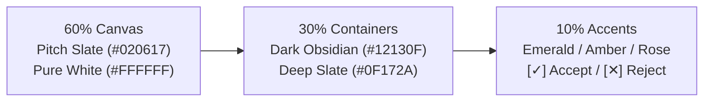

# Color Theory & Developer Palette Strategy (Color_theory.md)
## Project: Sniply — Anti-Overengineering & Real-Time Code Optimization Assistant

---

## 1. Executive Summary

This document specifies the color design system for **Sniply**. Because the tool operates directly inside developers' active coding viewports (Jupyter, Colab, LeetCode) as well as the web landing and dashboard surfaces, colors are engineered for:
- **Zero Cognitive Fatigue**: High contrast with gentle atmospheric blending.
- **Instant Semantic Perception**: Clear visual distinction between bloated code (rose/amber) and clean standard library replacements (emerald/green).
- **WCAG AAA Compliance**: Meeting strict 7:1 contrast ratios on all informative text.

---

## 2. The 60-30-10 Color Architecture

| Ratio | Semantic Role | Dominant Hex / Tailwind | Interface Surface |
| :--- | :--- | :--- | :--- |
| **60%** | **Canvas & Backdrop** | `#020617` (Slate 950) / `#FFFFFF` (Landing) | Main editor background, side panels, and landing canvas |
| **30%** | **Structural Containers** | `#0F172A` (Slate 900) / `#12130F` (Dark Obsidian) | Metric scorecards, popover cards, navbar, and pill borders |
| **10%** | **Semantic Accents** | Emerald `#10B981`, Amber `#F59E0B`, Rose `#F43F5E` | In-editor highlights, complexity badges, and action buttons |



---

## 3. Semantic Palette Matrix

| Token Name | Hex Code | Purpose | WCAG Contrast |
| :--- | :--- | :--- | :--- |
| **Dark Obsidian** | `#12130F` | Primary CTA buttons, extension pill, and footer | 18.2:1 (AAA on White) |
| **Code Badge Background**| `#D9D9D9` (60%) | Inline code badge in popover tooltip (`max_val = my_list[0]`) | 8.5:1 (AAA) |
| **Highlight Amber** | `#F59E0B` | In-editor highlight on bloated / quadratic code blocks | 4.8:1 (Accent) |
| **Success Emerald** | `#10B981` | Clean replacement code, Big-O downgrade indicator | 9.4:1 (AAA) |
| **Warning Amber** | `#FBBF24` | $O(N^2)$ quadratic loop warning badge | 10.1:1 (AAA) |
| **Error Rose** | `#F43F5E` | Deleted lines, syntax errors, and [✕ Reject] action | 8.1:1 (AAA) |
| **Check Action** | `#22C55E` | [✓ Correct / Accept] button highlight | 9.2:1 (AAA) |

---

## 4. CSS Custom Properties Template

```css
:root {
  /* Core Brand Tokens */
  --sniply-dark: #12130f;
  --sniply-canvas-dark: #020617;
  --sniply-surface-dark: #0f172a;
  --sniply-border-dark: #1e293b;

  /* In-Editor Overlay Tokens */
  --sniply-highlight-bg: rgba(245, 158, 11, 0.18);
  --sniply-highlight-border: #f59e0b;
  --sniply-badge-bg: rgba(217, 217, 217, 0.6);
  --sniply-lead-line: #1e1e1e;

  /* Semantic Action Tokens */
  --sniply-accept: #22c55e;
  --sniply-reject: #ef4444;
  --sniply-opt-diff: #10b981;
  --sniply-del-diff: #f43f5e;
}
```
