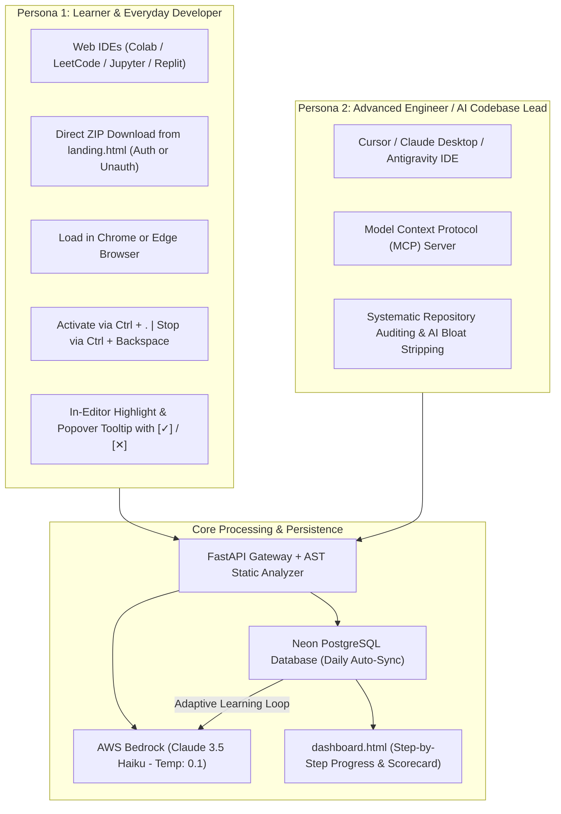
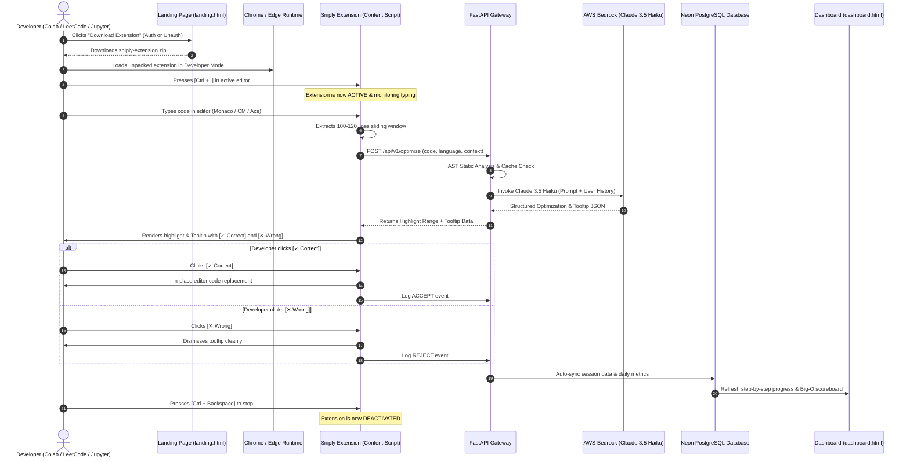

# Product Requirement Document (PRD.md)
## Project: Sniply — Anti-Overengineering & Real-Time Code Optimization Assistant

---

## 1. Executive Summary & Vision

The **Sniply: Anti-Overengineering & Code Optimization Assistant** is an intelligent, real-time developer companion built to eradicate **code bloat, artificial over-engineering, and unnecessary algorithmic complexity**. 

In modern software development and AI-assisted programming, developers frequently suffer from:
- **Suboptimal Algorithmic Patterns**: Writing quadratic loops ($O(n^2)$) where linear hash sets or maps ($O(n)$) or standard library primitives exist.
- **AI-Generated "Overflow Logic"**: Defensive guardrails for impossible conditions, speculative wrapper classes, and superfluous intermediate variables that clutter code.
- **Cognitive Overload**: Full-file LLM rewrites that obscure what actually changed instead of teaching clean coding principles.

Sniply directly integrates into the developer's active coding environment (**Google Colab, LeetCode, Jupyter Notebooks, HackerRank, CodeChef, Replit, Programiz, VS Code Web**), continuously monitoring active code through a **100–120 line sliding context window**. Powered by **AWS Bedrock (Claude 3.5 Haiku)** and synchronized with **Neon PostgreSQL**, Sniply surfaces inline in-editor tooltips with instant **[✓ Correct / Accept]** and **[✕ Wrong / Reject]** action buttons, records coding telemetry, and provides a comprehensive **step-by-step progress dashboard**.

---

## 2. Target Personas & Core User Journeys

### 2.1 Persona 1: Learner & Competitive Programmer
- **Environments**: Google Colab, LeetCode, CodeChef, HackerRank, JupyterLab, Programiz, OnlineGDB.
- **Experience**: Writes working logic but often falls into $O(n^2)$ algorithmic traps, redundant allocations, or syntax mistakes.
- **Workflow**:
  1. Downloads `sniply-extension.zip` from `landing.html` (no forced login required to get the extension).
  2. Installs unpacked zip into **Google Chrome** or **Microsoft Edge**.
  3. Enters their coding tab, starts typing code, and hits **`Ctrl + .`** to activate real-time assistance.
  4. When code has sufficient context, an in-editor highlight appears on the problematic line/token, accompanied by a clean popover tooltip explaining the issue and showing the fix.
  5. Clicks **[✓ Correct]** to replace the code in-place, or **[✕ Wrong]** to dismiss.
  6. Opens **`dashboard.html`** to track step-by-step savings (lines trimmed, Big-O reductions, syntax fixes).

### 2.2 Persona 2: Advanced Engineer & Team Lead
- **Environments**: Professional IDEs (Cursor, Claude Desktop, Antigravity) and web repositories.
- **Experience**: Reviews and writes production code with AI code generators (Copilot, Claude).
- **Pain Point**: AI assistants hallucinate verbose boilerplate, unnecessary factory classes, and defensive checks.
- **Workflow**: Connects Sniply via the MCP server or browser extension to systematically audit 100–120 line windows and strip AI bloat.

---

## 3. Core Functional Requirements

### 3.1 Mandatory Auth-Gated Extension Distribution (`landing.html` / `index.html`)
- **Mandatory Google Sign-In Gate**: Extension download is strictly locked until the developer authenticates with their Google account.
- **Automated Neon DB Registration**: Signing in instantly records the user's `firebase_uid`, `email`, and `displayName` into Neon PostgreSQL (`sniply_users`), enabling 100% developer tracking and telemetry.
- **Automated Package Delivery**: Once registered, the `sniply-extension.zip` download starts immediately without requiring secondary clicks.
- **Dual-Browser Compatibility**: Designed, tested, and fully supported for both **Google Chrome** (`chrome://extensions/`) and **Microsoft Edge** (`edge://extensions/`).
- **Quick-Start Instructions**: 5-step visual installation flow displayed on the landing page, clearly indicating that Google authentication is required to register and sync with `dashboard.html`.

### 3.2 Extension Lifecycle & Keyboard Controls
- **Start / Activate**: Pressing **`Ctrl + .`** (Ctrl + period) activates the extension's real-time monitoring and seeking engine.
- **Stop / Deactivate**: Pressing **`Ctrl + Backspace`** deactivates the extension and hides all active overlays.
- **Visual Status Pill**: Floating badge in the corner of the active editor indicates current status (`Active`, `Optimizing`, `Idle`, or `Stopped`).

### 3.3 Context Extraction Engine (100–120 Lines)
- **Sliding Window**: Extracts the active function or block around the cursor bounded strictly to **100–120 lines**.
- **Typing Debounce**: Intelligent 350ms typing debounce prevents spurious API calls while the user is actively typing.
- **Multi-Editor DOM Hooks**:
  - Monaco Editor (`.monaco-editor`, `.view-line`)
  - CodeMirror 6 (`.cm-content`, `.cm-line`)
  - CodeMirror 5 (`.CodeMirror-line`)
  - Ace Editor (`.ace_editor`, `.ace_line`)
  - Native `<textarea>` and contenteditable surfaces.

### 3.4 In-Editor Real-Time Auto-Tooltip & Highlight Overlay
- **Targeted Highlighting**: Dynamically injects a non-destructive highlight overlay directly over the offending line, keyword, variable, logic statement, or block in the code editor.
- **Interactive Tooltip**: An anchored popover box containing:
  - **Code Badge**: Displays original vs. suggested cleaner code (e.g. `max_val = my_list[0]`).
  - **Diagnostic Rationale**: Clear, plain-English explanation of syntax errors, intention mismatches, or Big-O bottlenecks.
  - **Action Buttons**:
    - **[✓ Correct / Accept]**: Automatically replaces the code in-place in the active editor and logs positive feedback.
    - **[✕ Wrong / Reject]**: Dismisses the tooltip immediately and logs feedback to avoid repeating undesirable suggestions.

### 3.5 Backend AI Gateway & AWS Bedrock Inference
- **FastAPI Gateway**: Asynchronous microservice exposing `/api/v1/optimize`, `/api/v1/sync`, and `/api/v1/analytics`.
- **AST Static Pre-Check**: Pre-analyzes loop depths, cyclomatic complexity, unused variables, and syntax errors before calling the LLM.
- **AWS Bedrock Engine**: Claude 3.5 Haiku (`anthropic.claude-3-5-haiku-20241022-v1:0`) executing at low temperature (`0.1`) for deterministic, ultra-fast (<700ms) simplicity reasoning.
- **Pattern Caching**: LRU/in-memory cache for common algorithmic patterns delivers instant (<50ms) suggestions.

### 3.6 Neon PostgreSQL Persistence & Daily Auto-Sync
- **Managed Database**: Cloud-native Neon PostgreSQL database with connection pooling and SSL (`sslmode=require`).
- **Core Schemas**:
  - `sniply_users`: Stores Firebase UID, email, display name, and last active timestamp.
  - `optimizations`: Records code snippets, editor URLs, before/after Big-O complexity, summary, lines saved, and mistakes detected JSONB.
  - `daily_metrics`: Aggregates total fixes, mistakes count, syntax errors prevented, and tokens consumed per day.
- **Daily & Working Auto-Sync**: Background pipeline syncs session telemetry, user coding progress, and accepted/rejected choices.
- **Adaptive User Learning**: AI improves its suggestions over time by learning from each user's accepted vs. rejected history.

### 3.7 Step-by-Step Progress Dashboard (`dashboard.html`)
- **Live Metrics**: Shows lines of bloat eliminated, quadratic loops downgraded, and syntax errors corrected.
- **Session History**: Detailed chronological step-by-step inspection log showing diffs and complexity reductions.
- **Daily Progress Timeline**: Visual activity chart reflecting ongoing development improvements.

---

## 4. End-to-End System Sequence Diagram

---

## 5. Success Metrics & Key Performance Indicators (KPIs)

| Metric | Target | Measurement Method |
| :--- | :--- | :--- |
| **Optimization Latency** | $< 700\text{ms}$ | End-to-end API roundtrip on Claude 3.5 Haiku |
| **Cache Hit Latency** | $< 50\text{ms}$ | Response time for normalized AST pattern cache |
| **Complexity Reduction Rate**| $\ge 80\%$ | Ratio of quadratic ($O(n^2)$) loops successfully downgraded to $O(n)$ |
| **Acceptance Rate** | $\ge 70\%$ | Ratio of [✓ Correct] clicks vs [✕ Wrong] clicks |
| **Browser Compatibility** | $100\%$ | Seamless execution on Google Chrome & Microsoft Edge |
| **Zero Setup Barrier** | Instant | Direct .zip download without mandatory authentication barrier |
