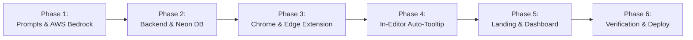

# Project Development Roadmap & Execution Phases (Phases.md)
## Project: Sniply — Anti-Overengineering & Real-Time Code Optimization Assistant

---

## 1. Roadmap & Architecture Milestones

---

## 2. Detailed Phase-by-Phase Execution Plan

### Phase 1: AI Prompt Engineering & AWS Bedrock Integration
- [x] Configure AWS Bedrock runtime client targeting `anthropic.claude-3-5-haiku-20241022-v1:0`.
- [x] Author Master Anti-Overengineering System Prompt with strict Ponytail decision hierarchy.
- [x] Formulate intention, syntax, and error classification schemas.
- [x] Define structured JSON output format:
  - `original_complexity`: Time & Space Big-O.
  - `optimized_complexity`: Time & Space Big-O.
  - `summary`: Educational explanation.
  - `line_changes`: Line-by-line diffs.
  - `tooltip`: Anchor position, offending snippet, suggested replacement, rationale, and action bindings.
- [x] Configure fallback for direct Anthropic API key execution.

### Phase 2: FastAPI Gateway & Neon PostgreSQL Database
- [x] Scaffold FastAPI asynchronous application (`backend/app.py`).
- [x] Implement Neon PostgreSQL connection pooling with enforced SSL (`sslmode=require`) in `backend/db.py`.
- [x] Initialize database schema tables:
  - `sniply_users`: Firebase UID, email, display name, last active.
  - `optimizations`: Code snippet, complexity before/after, lines saved, mistakes detected.
  - `daily_metrics`: Calendar date, total fixes, syntax errors corrected, tokens used.
- [x] Implement AST Static Analyzer:
  - Detect nested loop depths ($O(n^2)$ flag).
  - Detect unused variable assignments and dead branches.
  - Compute cyclomatic complexity.
- [x] Build REST endpoints: `POST /api/v1/optimize`, `POST /api/v1/auth/register`, `POST /api/v1/sync`, `GET /api/v1/analytics`.

### Phase 3: Cross-Browser Extension Core (Chrome & Microsoft Edge)
- [x] Configure Manifest V3 configuration supporting both **Google Chrome** and **Microsoft Edge**.
- [x] Register global keyboard command listeners in `manifest.json` and `content.js`:
  - **`Ctrl + .`**: Start / Activate Extension monitoring.
  - **`Ctrl + Backspace`**: Stop / Deactivate Extension.
- [x] Implement robust 100–120 lines sliding context window extractor across web editors:
  - **Monaco Editor** (Google Colab, LeetCode, CodeChef).
  - **CodeMirror 6** (Replit, JupyterLab 4).
  - **CodeMirror 5** (Classic Jupyter Notebook).
  - **Ace Editor** (Programiz, OnlineGDB, HackerRank).
  - Standard `<textarea>` and contenteditable inputs.
- [x] Build Background Service Worker (`background/service_worker.js`):
  - State machine (ACTIVE / IDLE / OPTIMIZING / STOPPED).
  - Storage management in `chrome.storage.local`.

### Phase 4: Real-Time In-Editor Highlight Overlay & Interactive Tooltip
- [x] Build DOM Code Highlighter:
  - Injects non-destructive highlight bounding boxes over offending lines, keywords, variables, or logic statements.
- [x] Build Interactive Auto-Sync Popover Tooltip:
  - Anchoring connecting line to the code line.
  - Code badge displaying original vs. cleaner replacement.
  - Diagnostic error & intention rationale.
  - Action buttons:
    - **[✓ Correct / Accept]**: In-place editor text replacement + `ACCEPT` telemetry emit.
    - **[✕ Wrong / Reject]**: Clean tooltip dismissal + `REJECT` feedback emit.
- [x] Implement in-place code replacement across all supported editors using native DOM selection and `execCommand("insertText")`.

### Phase 5: Landing Page Distribution & Step-by-Step Dashboard
- [x] Enhance Landing Page (`frontend/index.html`):
  - Mandatory Google OAuth sign-in gate before downloading `sniply-extension.zip` to register developer profiles into Neon DB (`sniply_users`).
  - 5-step visual guide for loading unpacked extension in Chrome & Edge.
  - Interactive hero code demo with connecting line and popover tooltip.
  - Google Sign-In with automatic download trigger upon authentication.
- [x] Build Step-by-Step Progress Dashboard (`frontend/dashboard.html` & `dashboard.js`):
  - Real-time telemetry cards (lines of bloat eliminated, Big-O reductions, syntax fixes).
  - Chronological inspection history log.
  - Daily activity and code health scorecards powered by Neon DB.

### Phase 6: Multi-Browser Verification, Benchmarking & Deployment
- [ ] End-to-end verification in **Google Chrome** (`chrome://extensions/`) and **Microsoft Edge** (`edge://extensions/`).
- [ ] End-to-end verification across web editors: Google Colab, LeetCode, Jupyter Notebooks.
- [ ] Latency benchmarking: ensure end-to-end roundtrip $< 700\text{ms}$ on AWS Bedrock Claude 3.5 Haiku.
- [ ] Deploy frontend to **Vercel** and backend to **Render / AWS App Runner**.
