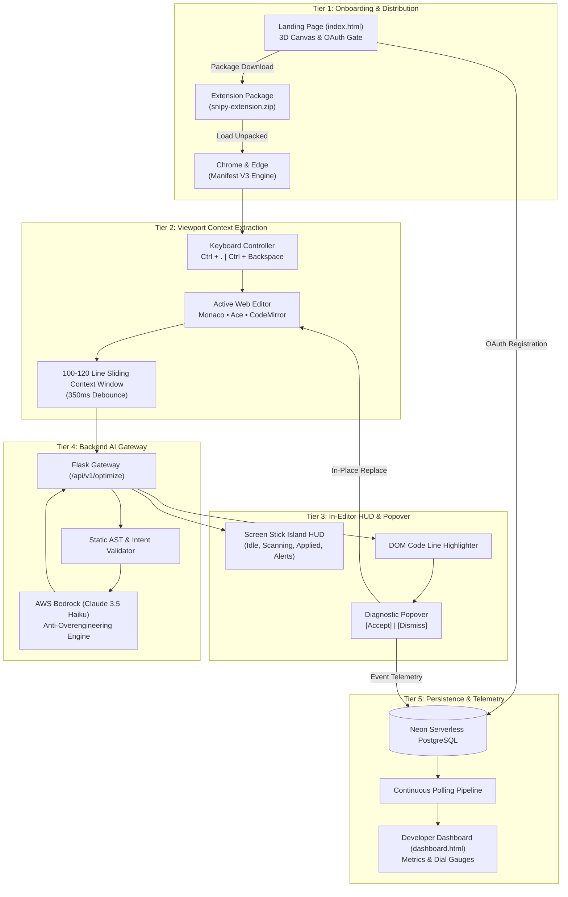

<div align="center">

  <a href="https://aws2-frontend.vercel.app">
    <picture>
      <source media="(prefers-color-scheme: dark)" srcset="frontend/assets/logo-white.svg">
      <source media="(prefers-color-scheme: light)" srcset="frontend/assets/logo.svg">
      
    </picture>
  </a>

  # Snipy
  ### Real-Time Code Optimization & Anti-Overengineering Assistant

  <p align="center">
    <a href="https://aws.amazon.com/bedrock/">
      
    </a>
    &nbsp;&nbsp;
    <a href="https://www.anthropic.com/claude">
      
    </a>
    &nbsp;&nbsp;
    <a href="https://github.com/CSMU-CodeSync">
      
    </a>
  </p>
  
  [](https://github.com/parthongit89/snipy-aws)
  [](https://aws.amazon.com/bedrock/)
  [](https://neon.tech/)
  [](https://flask.palletsprojects.com/)
  [](https://developer.chrome.com/docs/extensions/mv3/intro/)
  [](https://aws2-frontend.vercel.app)
  [](LICENSE)

  <p align="center">
    An in-editor simplicity filter and algorithmic coach that detects quadratic bottlenecks, unnecessary boilerplate, and artificial over-engineering in real time, replacing them with clean, idiomatic standard-library code.
  </p>

  <p align="center">
    <a href="#overview">Overview</a> &bull;
    <a href="#key-capabilities">Key Capabilities</a> &bull;
    <a href="#system-architecture">Architecture</a> &bull;
    <a href="#screen-stick-hud">Screen Stick HUD</a> &bull;
    <a href="#developer-experience--dashboard">Dashboard</a> &bull;
    <a href="#api-reference">API Reference</a> &bull;
    <a href="#installation--setup">Quickstart</a> &bull;
    <a href="#specifications--attribution">Attribution</a>
  </p>

</div>

---

## Overview

Modern software engineering and LLM-assisted development routinely suffer from artificial over-engineering:

- **Quadratic Bottlenecks ($O(N^2)$)**: Developers write nested lookups when linear hash structures ($O(N)$) or standard-library utilities achieve identical results in a single statement.
- **Boilerplate Bloat**: Automated code generators introduce premature class hierarchies, wrapper indirection, and defensive guards for unreachable branches.
- **Context Overhead**: Full-file rewrite tools disrupt workflow by requiring extensive manual review for two-line algorithmic adjustments.

### Solution

Snipy embeds directly into active web editor viewports (Google Colab, LeetCode, CodeChef, Jupyter Notebooks, HackerRank, Replit). 

Powered by **AWS Bedrock (Claude 3.5 Haiku)** and **Neon PostgreSQL**, Snipy continuously inspects active code within a non-intrusive **100–120 line sliding context window** through a 350ms debounce filter. When complexity anomalies or syntax bottlenecks are identified, it docks an interactive anchor popover directly above the code line, enabling instant, one-click in-place remediation.

---

## Key Capabilities

| Capability | Technical Mechanism | Developer Impact |
|:---|:---|:---|
| **Sliding Window Analysis** | Scopes active AST context across Monaco, Ace, CodeMirror 5/6, and Textarea viewports. | Zero repository dumping; captures 100–120 lines around active cursor with a 350ms debounce. |
| **Interactive Screen Stick HUD** | Dynamic island widget floating at viewport base with 7 contextual states. | Real-time diagnostic state, scan indicators, and shortcut hints without leaving the workspace. |
| **In-Editor Diagnostic Popover** | Anchored overlay displaying Big-O complexity comparison and remediation rationale. | Inspect logic analysis, compare Big-O impact, and apply or dismiss with a single click. |
| **In-Place Code Replacement** | Dispatches native editor selection and text insertion commands. | Code updates directly inside Monaco and Ace surfaces without clipboard switching. |
| **Telemetry & Usage Dashboard** | Horseshoe gauge meters, daily token allowance indicators, and historical event feeds. | Real-time tracking of lines saved, Big-O downgrades, and personal coding patterns. |
| **Neon PostgreSQL Persistence** | Parameterized relational storage tracking user preferences and telemetry. | Continuous session history, custom language rules, and live optimization scorecards. |

---

## Controls

| Shortcut | Action | Description |
|:---:|:---:|:---|
| `Ctrl + .` | **Activate / Analyze** | Initiates sliding window extraction and triggers AWS Bedrock optimization analysis. |
| `Ctrl + Backspace` | **Stop / Dismiss** | Halts background monitoring, clears DOM line highlights, and closes popovers. |

---

## System Architecture

Snipy operates as a decoupled five-tier pipeline engineered for low latency and high reliability:



---

## Screen Stick HUD

The extension surface features an anchored **Screen Stick HUD** built with dynamic island interface patterns and spring animation transitions (`cubic-bezier(0.16, 1, 0.3, 1)`):

```
+-------------------------------------------------------------------------+
|  [ Island Icon ]          Activate Snipy                 [ Ctrl + . ]   |
+-------------------------------------------------------------------------+
```

### Context State Matrix

| State | Asset Reference | Behavioral Specification |
|:---|:---|:---|
| **Idle / Ready** | `frontend/Screen-constraints/Group 41.png` | Default resting state. Displays island badge, action label, and activation hotkey. |
| **Scanning** | `frontend/Screen-constraints/Group 40.png` | Active inspection indicator featuring cyan pulse animation during Bedrock inference. |
| **Suggestion Applied** | `frontend/Screen-constraints/Suggestion apply.png` | Confirmation badge with transition feedback upon in-place code replacement. |
| **No Editor Found** | `frontend/Screen-constraints/Group 38.png` | Informational alert displayed when the focused element is non-editable. |
| **Language Unrecognized** | `frontend/Screen-constraints/Group 36.png` | Notifies user of unsupported syntax and prompts preference adjustment in Settings. |
| **System Exception** | `frontend/Screen-constraints/Group 37.png` | Fallback notification on network or API gateway timeout with automated dismissal. |
| **Active Inline Prompt** | `frontend/Screen-constraints/Group 58.png` | Context pill displaying detected function scope, error analysis, and inline actions. |
| **Enhanced Island** | `frontend/Screen-constraints/Group 59.png` | Primary dynamic HUD state featuring electric cyan accent ring and trigger state. |

---

## Developer Experience & Dashboard

The Snipy Dashboard (`dashboard.html`) visualizes developer efficiency and complexity trends:

### 1. Progress & Scorecards
- **Daily Quota Management**: 10 session tokens allocated per 24-hour cycle (~2.5 hours active coding duration).
- **Metric Arc Dials**:
  - `Mistakes`: Algorithmic defects and over-engineering patterns averted.
  - `Syntax`: Real-time syntax and type-hint issues resolved prior to execution.
  - `Usage`: Session quota consumption indicator.
- **Core Scorecards**:
  - `O(N²) -> O(N)` algorithmic optimizations logged.
  - Redundant boilerplate lines eliminated.
  - Pre-execution syntax defects corrected.
- **Session History Feed**: Searchable event log cards with diagnostic tags and complexity metrics.

### 2. Customization & Settings
- **Language Profiles**: Search and configure preferred languages with single-click addition chips.
- **Assistant Operational Modes**:
  - *Anti-Overengineering & Clean Code (Default)*
  - *Strict Big-O Downgrade ($O(N^2) \rightarrow O(N)$)*
  - *PEP 8 & Syntax Analysis*
  - *Step-by-Step Educational Mode*
- **Sliding Window Boundaries**: User-adjustable capture threshold capped strictly at 150 lines.

---

## Supported Environments

Snipy incorporates specialized DOM adapters for major web-based code surfaces:

- **Monaco Editor**: Google Colab, LeetCode, CodeChef, HackerRank.
- **CodeMirror 6**: Replit, JupyterLab 4.
- **CodeMirror 5**: Classic Jupyter Notebooks.
- **Ace Editor**: Programiz, OnlineGDB, GeeksforGeeks.
- **Standard Web Inputs**: Textarea surfaces and contenteditable code regions.

---

## API Reference

### 1. Code Optimization
`POST /api/v1/optimize`

Analyzes the active code segment through AWS Bedrock Claude 3.5 Haiku.

**Request:**
```json
{
  "code": "def find_dup(arr):\n    res = []\n    for i in arr:\n        if i not in res: res.append(i)\n    return res",
  "language": "python",
  "context": "# 100-120 line sliding window context",
  "userId": "firebase_uid_12345",
  "editorUrl": "https://www.codechef.com/ide"
}
```

**Response:**
```json
{
  "success": true,
  "data": {
    "status": "OVERENGINEERED",
    "bad_code_line": "if i not in res: res.append(i)",
    "simplified_code_line": "return list(dict.fromkeys(arr))",
    "rationale": "Replaced O(N²) list scan with O(N) order-preserving dictionary deduplication.",
    "optimized_complexity": "O(N) Linear Time",
    "full_optimized_code": "def find_dup(arr):\n    return list(dict.fromkeys(arr))"
  }
}
```

### 2. Telemetry Feedback
`POST /api/v1/feedback`

Records developer response (`ACCEPT` vs `REJECT`) for dashboard metrics and analytics.

### 3. Account Synchronization
`POST /api/v1/auth/register`

Synchronizes user profile attributes (`firebase_uid`, `email`, `displayName`, `photoURL`) upon Google authentication.

### 4. Telemetry Statistics
`GET /api/v1/user/stats?userId=<uid>`

Returns session scorecards, gauge percentages, and optimization event logs.

---

## Installation & Setup

### 1. Browser Extension
1. Access the web interface at [`https://aws2-frontend.vercel.app`](https://aws2-frontend.vercel.app).
2. Authenticate with Google to initialize user records in Neon PostgreSQL.
3. Download `snipy-extension.zip` or clone the repository to access the `extension/` directory.
4. Navigate to `chrome://extensions/` in Google Chrome (or `edge://extensions/` in Microsoft Edge).
5. Toggle **Developer mode** in the top-right corner.
6. Select **Load unpacked** and choose the `extension/` folder.

### 2. Local Backend Service
```bash
# Navigate to backend directory
cd backend

# Create and activate Python virtual environment
python -m venv venv
venv\Scripts\activate      # Windows
# source venv/bin/activate # Linux / macOS

# Install dependencies
pip install -r requirements.txt

# Launch local backend server
python app.py
```

### 3. Production Deployments
- **Web Interface & Landing**: [`https://aws2-frontend.vercel.app`](https://aws2-frontend.vercel.app)
- **Developer Dashboard**: [`https://aws2-frontend.vercel.app/dashboard.html`](https://aws2-frontend.vercel.app/dashboard.html)
- **API Gateway Service**: [`https://aws-2-u2md.onrender.com`](https://aws-2-u2md.onrender.com)

---

## Security & Privacy

- **Bounded Context Capture**: The extension restricts code extraction strictly to the 100–120 line boundary surrounding the active cursor. It never reads or transmits entire repositories.
- **Zero Keystroke Logging**: Code is evaluated solely upon deliberate trigger (`Ctrl + .` or Screen Stick HUD). Continuous background typing logs are never recorded.
- **Encrypted Transmission**: All data in transit utilizes TLS 1.3 encryption. Backend database queries execute strictly via parameterized PostgreSQL statements.
- **Manifest V3 Sandboxing**: Extension scripts operate inside isolated content execution contexts, prohibiting cross-origin privilege leaks.

---

## Specifications & Attribution

<div align="center">
  <table>
    <tr>
      <td align="center" width="220">
        <a href="https://github.com/parthongit89/snipy-aws">
          <br /><br />
          <b>parthongit89/snipy-aws</b><br />
          <sub>Project Repository</sub>
        </a>
      </td>
      <td align="center" width="220">
        <a href="https://github.com/CSMU-CodeSync">
          <br /><br />
          <b>CSMU-CodeSync</b><br />
          <sub>Development Team</sub>
        </a>
      </td>
      <td align="center" width="260">
        <a href="https://github.com/CSMU-CodeSync">
          <br /><br />
          <b>AWS Hackathon x CSMU</b><br />
          <sub>Official Competition Build</sub>
        </a>
      </td>
    </tr>
  </table>
</div>

- **Repository**: [`https://github.com/parthongit89/snipy-aws`](https://github.com/parthongit89/snipy-aws)
- **Team**: [CSMU-CodeSync](https://github.com/CSMU-CodeSync)
- **Support**: [codesync0208@gmail.com](mailto:codesync0208@gmail.com)
- **System Blueprint**: [`sniply.drawio`](sniply.drawio)
- **Product Requirements Document**: [`PRD.md`](PRD.md)
- **Architecture Specification**: [`Architecture.md`](Architecture.md)
- **Database Topology & Security**: [`Security_db.md`](Security_db.md)
- **Frontend Design System**: [`Designs.md`](Designs.md)

---

<div align="center">
  <p><sub>Developed by CSMU-CodeSync for clean, minimal, anti-overengineered software development.</sub></p>
  <p><strong>Snipy &copy; 2026. All rights reserved.</strong></p>
</div>