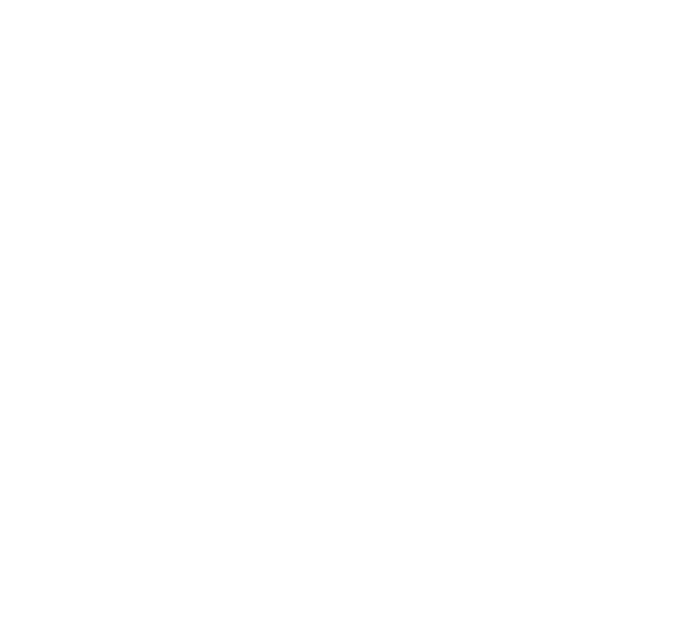
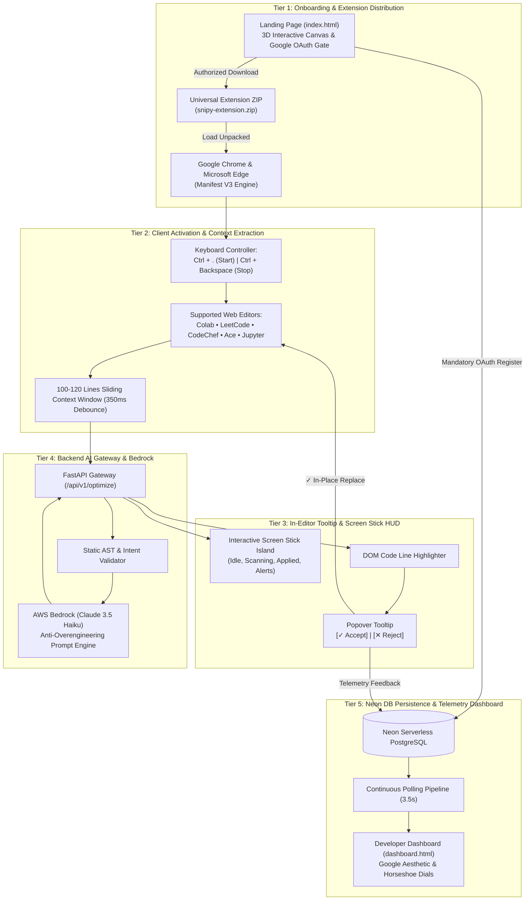

<div align="center">

  <a href="https://aws2-frontend.vercel.app">
    <picture>
      <source media="(prefers-color-scheme: dark)" srcset="frontend/assets/logo-white.svg">
      <source media="(prefers-color-scheme: light)" srcset="frontend/assets/logo.svg">
      
    </picture>
  </a>

  # Snipy
  ### Real-Time Anti-Overengineering Assistant & Code Optimization Coach

  <p align="center">
    <a href="https://aws.amazon.com/bedrock/">
      
    </a>
    &nbsp;&nbsp;
    <a href="https://www.anthropic.com/claude">
      
    </a>
    &nbsp;&nbsp;
    <a href="https://github.com/CSMU-CodeSync">
      
    </a>
  </p>
  
  [](https://github.com/parthongit89/snipy-aws)
  [](https://aws.amazon.com/bedrock/)
  [](https://neon.tech/)
  [](https://flask.palletsprojects.com/)
  [](https://developer.chrome.com/docs/extensions/mv3/intro/)
  [](https://aws2-frontend.vercel.app)
  [](LICENSE)

  <p align="center">
    <strong>An in-editor simplicity filter and algorithmic coach that detects O(N²) bottlenecks and AI-generated bloat in real time, replacing them in-place with clean, idiomatic standard-library code.</strong>
  </p>

  <p align="center">
    <a href="#-product-overview">Product Overview</a> •
    <a href="#-key-features">Key Features</a> •
    <a href="#-3d-interactive-developer-landing-page">3D Landing Experience</a> •
    <a href="#-interactive-screen-stick-hud">Screen Stick HUD</a> •
    <a href="#-5-tier-system-architecture">Architecture</a> •
    <a href="#-developer-telemetry-dashboard">Dashboard</a> •
    <a href="#-api-reference">API Reference</a> •
    <a href="#-quickstart--installation">Quickstart</a>
  </p>

</div>

---

## 📖 Product Overview

In modern software development and AI-assisted programming, codebases frequently suffer from **artificial over-engineering and boilerplate bloat**:
- **Quadratic Inefficiency ($O(N^2)$)**: Developers write nested iterations when simple linear hash sets ($O(N)$) or standard library built-ins achieve the same in one line.
- **LLM "Overflow Logic"**: AI chatbots frequently generate premature object-oriented hierarchies, unnecessary intermediate wrappers, and defensive guards for impossible edge conditions.
- **Cognitive Overload**: Full-file rewrites force developers to read hundreds of lines to verify a two-line logic fix.

### What Snipy Does
**Snipy operates right inside your active web coding viewports** (Google Colab, LeetCode, CodeChef, Jupyter Notebooks, HackerRank, Replit, Programiz, GeeksforGeeks). 

Powered by **AWS Bedrock (Claude 3.5 Haiku)** and **Neon PostgreSQL**, Snipy observes active code through a non-intrusive **100–120 line sliding context window** with a 350ms typing debounce. When over-engineering or algorithmic traps occur, it anchors an interactive **[✓ Accept / Correct]** vs **[✕ Reject / Dismiss]** popover tooltip directly above the code line, allowing **one-click in-place replacement**.

---

## ⚡ Key Features

| Capability | Technical Implementation | Value to Developer |
|:---|:---|:---|
| **100–120 Line Sliding Window** | Captures active function context across Monaco, Ace, CodeMirror 5/6, and Textarea surfaces. | Zero full-file dumps; only examines code in immediate cursor context with a 350ms debounce. |
| **Interactive 3D Landing Experience** | Real-time HTML5 3D isometric canvas, cursor spotlight, and interactive in-editor code switcher. | Production-grade developer aesthetic inspired by VS Code and Antigravity. |
| **Screen Stick HUD** | Floating dynamic island widget at bottom screen with 7 contextual states. | Instant visual feedback for scanning, errors, and shortcuts without leaving the editor. |
| **Non-Destructive Popover Tooltip** | Anchored in-editor tooltip directly over bloated code with Big-O diagnostic rationale. | Inspect diagnosis, compare Big-O complexity, and accept or dismiss with one click. |
| **Instant In-Place Replacement** | Executes native editor commands (`insertText` / DOM selection). | Code updates immediately inside Monaco/Ace without manual copying and pasting. |
| **Mandatory OAuth Telemetry** | Firebase Google Authentication gate required before downloading extension. | Syncs user telemetry (`sniply_users`) to personal Neon DB for continuous learning. |
| **Developer Telemetry Dashboard** | Figma-exact design with horseshoe arc gauges, token quota bar, and live history cards. | Live session logs, fixes history, custom language rules, and AI tailoring modes. |
| **Continuous Real-Time Sync** | Neon DB auto-polling + browser storage listeners. | In-editor accepts/rejects reflect on the dashboard live without manual refresh. |

---

## 🎮 Global Keyboard Controls

| Shortcut | Action | Description |
|:---:|:---:|:---|
| **`Ctrl + .`** *(Ctrl + Period)* | **Activate / Scan** | Starts Snipy monitoring, triggers sliding window capture, and runs Bedrock quality analysis. |
| **`Ctrl + Backspace`** | **Stop / Dismiss** | Halts active monitoring, dismisses active highlights, and silences popovers. |

---

## 🌌 3D Interactive Developer Landing Page

The official Snipy landing page ([`frontend/index.html`](https://aws2-frontend.vercel.app)) features a cinematic dark-tech developer aesthetic inspired by **VS Code, Google Antigravity, Cursor, and Linear**:

1. **Interactive 3D Zero-Gravity Canvas**:
   - Custom vanilla JS 3D projection engine rendering 7 floating frosted-glass isometric cubes at varying Z-depths.
   - Glassmorphic translucent faces, specular reflections, glowing wireframe edges (Emerald `#10B981`, Cyan `#38BDF8`, Amber `#F59E0B`), and soft ground drop shadows.
   - **Interactive Mouse Parallax**: The 3D scene tilts and reacts smoothly as the visitor moves their cursor.
   - Respects `prefers-reduced-motion` for accessibility.
2. **Fine Developer Dot-Matrix Grid with Cursor Spotlight**:
   - High-density coordinate dot-matrix grid with an interactive 200px radial cursor spotlight that dynamically illuminates nearby intersections.
3. **3D Perspective Horizon Plane**:
   - Angled 3D horizon coordinate grid (`perspective(600px) rotateX(65deg)`) with a radial vignette mask fading seamlessly into deep obsidian.
4. **Interactive In-Editor Code Preview**:
   - Live code comparison simulator allowing visitors to toggle between **"Bloated O(N²)"** and **"Clean O(N)"** or click **[✓ Accept]** on the inline popover to watch the code transform in-place.
5. **Dual-View Product Showcase**:
   - Interactive switcher displaying both the in-editor HUD popover and the real developer telemetry dashboard.

---

## 🪄 Interactive Screen Stick HUD

The browser extension features a floating **Screen Stick HUD** inspired by modern dynamic island design tokens, rendered with smooth spring physics (`cubic-bezier(0.16, 1, 0.3, 1)`):

```
+-------------------------------------------------------------------------+
|  [ 3D Cube Icon ]     Activate Snipy                  [ Ctrl + . ]     |
+-------------------------------------------------------------------------+
```

### Screen Stick State Matrix

| State | Preview / Asset | Trigger & Interactive Behavior |
|:---|:---|:---|
| **Idle / Ready** | `frontend/Screen-constraints/Group 41.png` | Default state. Displays wireframe cube icon, **"Activate Snipy"**, and `Ctrl + .` badge. Click to scan. |
| **Scanning** | `frontend/Screen-constraints/Group 40.png` | Displays **"Scanning Code...."** with a glowing cyan-blue breathing pulse (`sniply-stick-pulse`). |
| **Suggestion Applied** | `frontend/Screen-constraints/Suggestion apply.png` | Displays **"✓ Suggestion apply"** with emerald bounce animation upon in-place code replacement. |
| **No Editor Found** | `frontend/Screen-constraints/Group 38.png` | Displays **"Oops! code editor not found"** when focused element is non-editable. |
| **Language Not Recognized** | `frontend/Screen-constraints/Group 36.png` | Displays **"Language not recognized. Please update settings."** Click directly opens Settings! |
| **Something Went Wrong** | `frontend/Screen-constraints/Group 37.png` | Fallback alert on network/API exception with auto-revert timer. |
| **Active Inline Fix Prompt** | `frontend/Screen-constraints/Group 58.png` | Displays detected function (`avg_num()`), diagnostic reasoning, and inline [✓ Accept] / [✕ Reject] action controls. |
| **Enhanced HUD Island** | `frontend/Screen-constraints/Group 59.png` | Dynamic Island HUD with electric cyan-blue border accent and shortcut trigger. |

---

## 🏗️ 5-Tier System Architecture

Snipy follows a decoupled 5-tier architecture built for low latency and high reliability:



---

## 📊 Developer Telemetry Dashboard

The Snipy Dashboard (`dashboard.html`) tracks developer code quality over time:

### 1. Progress & Usage (`Figma Node 1:3 / 24:84`)
- **Total Token Usage**: 10 daily tokens (~2.5 hours active coding time), auto-resetting every 24 hours.
- **3 Horseshoe Arc Dials**:
  - `Mistakes` — Defect and bloat occurrences prevented.
  - `Syntax` — Real-time syntax and edge-case exceptions resolved.
  - `Usage` — Overall quota activity percentage.
- **Scorecard Metrics**:
  - `O(N²) ➔ O(N)` — Algorithmic downgrades achieved.
  - `Bloat Lines Trimmed` — Lines of redundant boilerplate eliminated.
  - `Syntax Errors Fixed` — Runtime bugs caught before execution.
- **History Feed**: Live session cards with keyword pills, diagnostics, search filters, and sorting.

### 2. Personalization (`Figma Node 4:138 / 24:256`)
- Search preferred programming languages with instant `+` chip addition (`Python`, `C`, etc.).
- Custom AI Tailoring preferences: Provide your stack, custom coding guidelines, and performance targets.

### 3. Settings (`Figma Node 6:243 / 24:344`)
- **4 Assistant Modes**:
  - *Anti-Overengineering & Clean Code (Default)*
  - *Strict Big-O Downgrade ($O(N^2) \rightarrow O(N)$)*
  - *PEP 8 & Syntax Doctor*
  - *Beginner Step-by-Step Educational Mode*
- **Sliding Context Window Configuration**: Strict cap at 150 lines max.
- **Preferences**: 90-day cookies and LocalStorage persistence across all sessions.

---

## 🌐 Supported Coding Environments

Snipy contains dedicated content adapters for every major browser editor:

- **Monaco Editor**: Google Colab, LeetCode, CodeChef, HackerRank.
- **CodeMirror 6**: Replit, JupyterLab 4.
- **CodeMirror 5**: Classic Jupyter Notebooks.
- **Ace Editor**: Programiz, OnlineGDB, GeeksforGeeks.
- **Native Web Components**: Standard code `textarea` and `contenteditable` inputs.

---

## 🔌 API Reference

### 1. `POST /api/v1/optimize`
Analyzes active code snippet through AWS Bedrock Claude 3.5 Haiku.

**Request Payload:**
```json
{
  "code": "def find_dup(arr):\n    res = []\n    for i in arr:\n        if i not in res: res.append(i)\n    return res",
  "language": "python",
  "context": "# 100-120 line sliding window context",
  "userId": "firebase_uid_12345",
  "editorUrl": "https://www.codechef.com/ide"
}
```

**Response Payload:**
```json
{
  "success": true,
  "data": {
    "status": "OVERENGINEERED",
    "bad_code_line": "if i not in res: res.append(i)",
    "simplified_code_line": "return list(dict.fromkeys(arr))",
    "rationale": "Replaced O(N²) list scan with O(N) order-preserving dictionary deduplication.",
    "optimized_complexity": "O(N) Linear Time",
    "full_optimized_code": "def find_dup(arr):\n    return list(dict.fromkeys(arr))"
  }
}
```

### 2. `POST /api/v1/feedback`
Records developer action (`ACCEPT` vs `REJECT`) for continuous telemetry in Neon DB.

### 3. `POST /api/v1/auth/register`
Synchronizes user profile (`firebase_uid`, `email`, `displayName`, `photoURL`) upon Google sign-in.

### 4. `GET /api/v1/user/stats?userId=<uid>`
Returns live session metrics, horseshoe gauge percentages, and recent optimization cards.

---

## 🚀 Quickstart & Installation

### Step 1: Install the Browser Extension
1. Open the landing page ([`https://aws2-frontend.vercel.app`](https://aws2-frontend.vercel.app)).
2. Sign in with Google to create your account in Neon DB.
3. Download `snipy-extension.zip` (or load unpacked from repository `extension/`).
4. In **Google Chrome**, open `chrome://extensions/` (or in **Edge**, `edge://extensions/`).
5. Enable **Developer mode** (top-right toggle).
6. Click **Load unpacked** and select the unzipped `extension/` folder.

### Step 2: Run the Backend Locally
```bash
# Navigate to backend directory
cd backend

# Create and activate Python virtual environment
python -m venv venv
# Windows:
venv\Scripts\activate
# Linux / macOS:
# source venv/bin/activate

# Install required dependencies
pip install -r requirements.txt

# Start the Flask backend server
python app.py
# Or with Gunicorn:
# gunicorn app:app --bind 0.0.0.0:8080 --workers 2
```

### Step 3: Access the Frontend & Dashboard
- **Production Landing Page**: [`https://aws2-frontend.vercel.app`](https://aws2-frontend.vercel.app)
- **Developer Dashboard**: [`https://aws2-frontend.vercel.app/dashboard.html`](https://aws2-frontend.vercel.app/dashboard.html)
- **Backend API**: [`https://aws-2-u2md.onrender.com`](https://aws-2-u2md.onrender.com)

---

## 🛡️ Security & Privacy Transparency

- **Sliding Window Privacy**: Snipy restricts context capture strictly to 100–120 lines around the active cursor. It **never scans or uploads whole repositories**.
- **No Keystroke Logging**: The extension only inspects code when explicitly invoked via **`Ctrl + .`** or the Screen Stick HUD.
- **SSL / Neon DB Encryption**: All user data, metrics, and session telemetry are transmitted over TLS 1.3 with parameterized PostgreSQL queries.
- **Isolated Manifest V3 Sandbox**: Content scripts interact through scoped messaging, preventing cross-tab credential leakage.

---

## 👥 Contributors & Architecture Blueprint

<div align="center">
  <table>
    <tr>
      <td align="center" width="220">
        <a href="https://github.com/parthongit89/snipy-aws">
          <br /><br />
          <b>parthongit89/snipy-aws</b><br />
          <sub>Project Repository</sub>
        </a>
      </td>
      <td align="center" width="220">
        <a href="https://github.com/CSMU-CodeSync">
          <br /><br />
          <b>CSMU-CodeSync</b><br />
          <sub>GitHub Organization</sub>
        </a>
      </td>
      <td align="center" width="280">
        <a href="https://github.com/CSMU-CodeSync">
          <br /><br />
          <b>AWS Hackathon's x CSMU</b><br />
          <sub>Official Hackathon Edition</sub>
        </a>
      </td>
    </tr>
  </table>
</div>

- **GitHub Repository**: [`https://github.com/parthongit89/snipy-aws`](https://github.com/parthongit89/snipy-aws)
- **Organization / Team**: [CSMU-CodeSync](https://github.com/CSMU-CodeSync)
- **Contact & Support**: [codesync0208@gmail.com](mailto:codesync0208@gmail.com)
- **Master System Blueprint**: [`sniply.drawio`](sniply.drawio)
- **Product Requirements Document**: [`PRD.md`](PRD.md)
- **Architecture Specification**: [`Architecture.md`](Architecture.md)
- **Database Topology & Security**: [`Security_db.md`](Security_db.md)
- **Frontend Design System**: [`Designs.md`](Designs.md)

---

<div align="center">
  <p><sub>Built with ❤️ by <a href="https://github.com/CSMU-CodeSync">CSMU-CodeSync</a> for clean, minimal, anti-overengineered code across all developer communities.</sub></p>
  <p><strong>Snipy © 2026. All rights reserved.</strong></p>
</div>